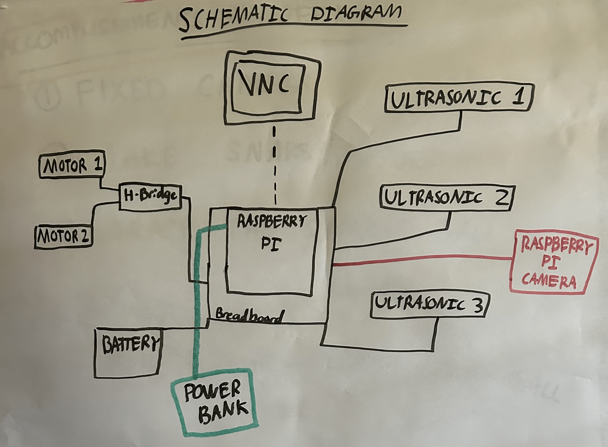

# Ball-Tracking Robot
Have you ever wondered about how Tesla vehicles are able to track every single object they encounter? The ball-tracking robot can also carry out the same function with a smaller size.

| **Engineer** | **School** | **Area of Interest** | **Grade** |
|:--:|:--:|:--:|:--:|
| Vaibhav S | Ponderosa High School | Electrical Engineering | Incoming Junior |


  
# Final Milestone
<iframe width="560" height="315" src="https://www.youtube.com/embed/Ya3F42WpKdc" title="YouTube video player" frameborder="0" allow="accelerometer; autoplay; clipboard-write; encrypted-media; gyroscope; picture-in-picture; web-share" allowfullscreen></iframe>

Since I finally got the raspberry pi camera working, I worked on improving the image processing to track the ball better. I also ran the motors to go forward and reverse but a few wires were in the wrong spot, causing the robot to spin instead of going forward or reverse. I swapped a few wires in different spots and the motors were finally able to move forward and backward. After debugging the motor wires, I pasted the motor code into the main image processing code. If the ball was farther away from the robot, the robot would move forward towards the ball. If the ball is very close, the robot would stop. 


# Second Milestone
<iframe width="560" height="315" src="https://www.youtube.com/embed/wealEdxyzZw " title="YouTube video player" frameborder="0" allow="accelerometer; autoplay; clipboard-write; encrypted-media; gyroscope; picture-in-picture; web-share" allowfullscreen></iframe>

Previously, I was having issues with the first raspberry pi camera module. Now in the second milestone, I was more careful with the new camera module and it was successfully connected to the raspberry pi. With the new raspberry pi module, I was able to take a picture. And then I ran the program for the raspberry pi camera to detect the ball and also connected the ultrasonic sensor code for them to work simultaneously to track the ball better. The plan later is to then make the motors follow the ball.

# First Milestone
<iframe width="560" height="315" src="https://www.youtube.com/embed/W6_buYm4MoE" title="YouTube video player" frameborder="0" allow="accelerometer; autoplay; clipboard-write; encrypted-media; gyroscope; picture-in-picture; web-share" allowfullscreen></iframe>

The ball tracking robot can locate certain objects using a camera and 3 sensors. The three ultrasonic sensors are used to detect objects from all directions. The motors allow the robot to move towards the ball. The H brick is what connects the motors to the breadboard. The breadboard carries out the instructions from the raspberry pi to the motors and sensors. 4 AA batteries are needed to power the motors. The raspberry pi is what gives the motors and sensors instructions. The biggest challenge this time was connecting the raspberry pi camera module. It was accidentally placed backwards and it broke.

# Schematics 


# Code
``` python
from picamera2 import Picamera2, Preview
from gpiozero import DistanceSensor
import time
import cv2
import RPi.GPIO as gpio
import numpy as np
gpio.setmode(gpio.BCM)
gpio.setup(17, gpio.OUT)
gpio.setup(22, gpio.OUT)
gpio.setup(23, gpio.OUT)
gpio.setup(24, gpio.OUT)
ultrasonic1 = DistanceSensor(echo=8, trigger=25, threshold_distance=0.5) #For the Ultrasonic sensors
ultrasonic2 = DistanceSensor(echo=21, trigger=12, threshold_distance=0.5) 
def forward(sec):
   gpio.output(17, True)
   gpio.output(22, False)
   gpio.output(23, True) 
   gpio.output(24, False)
   time.sleep(sec)

def reverse(sec):
   gpio.output(17, False)
   gpio.output(22, True)
   gpio.output(23, False) 
   gpio.output(24, True)
   time.sleep(sec)

def rightturn(sec):
      gpio.output(17, False)
      gpio.output(22, True)
      gpio.output(23, True)
      gpio.output(24, False)
      time.sleep(sec)
     
def leftturn(sec):
      gpio.output(17, True)
      gpio.output(22, False)
      gpio.output(23, False)
      gpio.output(24, True)
      time.sleep(sec)

def stop(sec):
   gpio.output(17, False)
   gpio.output(22, False)
   gpio.output(23, False) 
   gpio.output(24, False)
   time.sleep(sec)
def distanceSensor(): #Ultrasonic 1,2 Detection
    return ultrasonic1.distance*100,ultrasonic2.distance*100 
def segment_colour(frame):   
    hsv_roi =  cv2.cvtColor(frame, cv2.COLOR_RGB2HSV)
    
    mask_1 = cv2.inRange(hsv_roi, np.array([0,100,20]), np.array([50,255,255])) 

    mask = mask_1 
    kern_dilate = np.ones((96,96),np.uint8)
    kern_erode  = np.ones((48,48),np.uint8)
    mask=     cv2.erode(mask,kern_erode)
    mask=     cv2.dilate(mask,kern_dilate)
    (h,w) = mask.shape
    cv2.imshow("mask",mask)
    cv2.waitKey(1)
    return mask
def find_blob(blob):  
    largest_contour=0
    cont_index=0
    contours, hierarchy = cv2.findContours(blob, cv2.RETR_CCOMP, cv2.CHAIN_APPROX_SIMPLE)
    for idx, contour in enumerate(contours):
        area=cv2.contourArea(contour)
        if (area >largest_contour):
            largest_contour=area
            cont_index=idx
                    
    r=(0,0,2,2)
    if len(contours) > 0:
        r = cv2.boundingRect(contours[cont_index])
     
    return r,largest_contour
picam2 = Picamera2()
camera_config = picam2.create_still_configuration(main={"size": (640, 480)},
lores={"size": (640, 480)}, display="lores")
picam2.configure(camera_config)
#picam2.start_preview(Preview.QTGL) #Comment this out if not using desktop interface
picam2.start()
time.sleep(2)

while(True):
    dis1,dis2 = distanceSensor()
    print (dis1,dis2)
    im = picam2.capture_array()
    cv2.imshow("image",im[::-1])
    cv2.waitKey(1)
    height = im.shape[0]
    width = im.shape[1]

#fucntion 1
    mask_red=segment_colour(im)
#fucntion 2

    loct,area=find_blob(mask_red)
    x,y,w,h=loct
    centerY = y + (h/2)
    centerX = x + (w/2)
    print (centerX,centerY)
    print (area)
    if (area > 200000 or dis1 < 10 or dis2 < 10):
        stop(0.01)
 
    elif centerX < 150:  #If the ball is on left side of camera, it will turn left
        leftturn(0.01)
        print("left")
        ball = 1
    elif centerX > 490:  #If the ball is on right side of camera, it will turn right
        rightturn(0.01)
        #stop(0.01)
        print("right")
        ball = 2
    else:
        forward(0.01)  #The robot keeps moving towards the ball at a distance
        #stop(0.05)
        print("forward")
# Credit for code goes to Justin Miner and Effie Blustone
```

# Bill of Materials

| **Part** | **Note** | **Price** | **Link** |
|:--:|:--:|:--:|:--:|
| Raspberry Pi | Running program | $104.99 | <a href="https://www.amazon.com/Arduino-A000066-ARDUINO-UNO-R3/dp/B008GRTSV6/"> Link </a> |
| Robot Chassis | Body of the robot | $8.99 | <a href="https://www.amazon.com/Arduino-A000066-ARDUINO-UNO-R3/dp/B008GRTSV6/"> Link </a> |
| Raspberry Pi Camera | Detecting the object | $6.99 | <a href="https://www.amazon.com/Arduino-A000066-ARDUINO-UNO-R3/dp/B008GRTSV6/"> Link </a> |
| Screwdriver Kit | To build the chassis of robot | $6.99 | <a href="https://www.amazon.com/Small-Screwdriver-Set-Mini-Magnetic/dp/B08RYXKJW9/"> Link </a> 
| Ultrasonic Sensors | To detect distance between object | $9.99 | <a href="https://www.amazon.com/WWZMDiB-HC-SR04-Ultrasonic-Distance-Measuring/dp/B0CQCCGXCP/"> Link </a>
| H Bridges | To connect motors to raspberry pi | $8.99 | <a href="https://www.amazon.com/ACEIRMC-Stepper-Controller-2-5-12V-H-Bridge/dp/B0923VMKSZ/"> Link </a>
| Electronic Kit | Wires to connect sensors to raspberry pi | $9.99 | <a href="https://www.amazon.com/EL-CK-002-Electronic-Breadboard-Capacitor-Potentiometer/dp/B01ERP6WL4/"> Link </a> 
| Motors | To move the robot | $9.99 | <a href="https://www.amazon.com/AEDIKO-Motor-Gearbox-200RPM-Ratio/dp/B09N6NXP4H/"> Link </a>
| Multimeter | To test voltage to ensure proper connection | $12.99 | <a href="https://www.amazon.com/AstroAI-Digital-Multimeter-Voltage-Tester/dp/B01ISAMUA6/"> Link </a>
| Ball | Object for robot to track | $10.95 - $25.00 | <a href="https://www.amazon.com/CSI-Cannon-Sports-Duro-Skin/dp/B0000BY9GE/"> Link </a>
| Batteries | Power on the motors | $14.99 | <a href="https://www.amazon.com/Energizer-Batteries-Double-Alkaline-Battery/dp/B07TXNX6S2/"> Link </a>
| Power Bank | Keeps Raspberry Pi on while car is moving | $17.99 | <a href="https://www.amazon.com/SIXTHGU-Portable-Charger-Charging-Flashlight/dp/B0C7PHKKNK/"> Link </a> 
